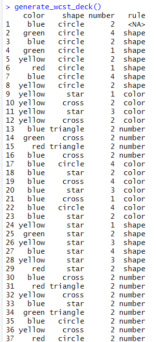
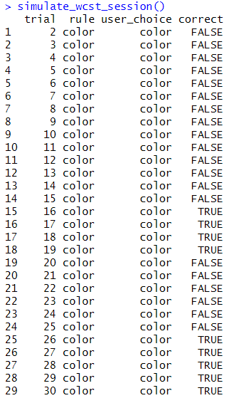
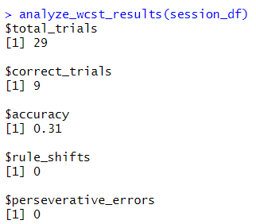
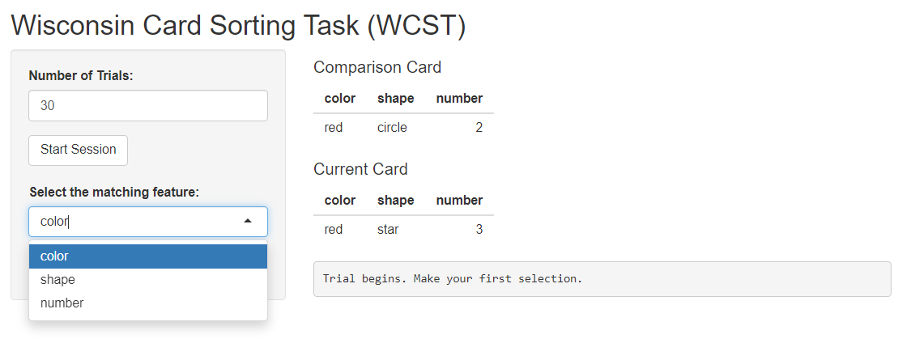
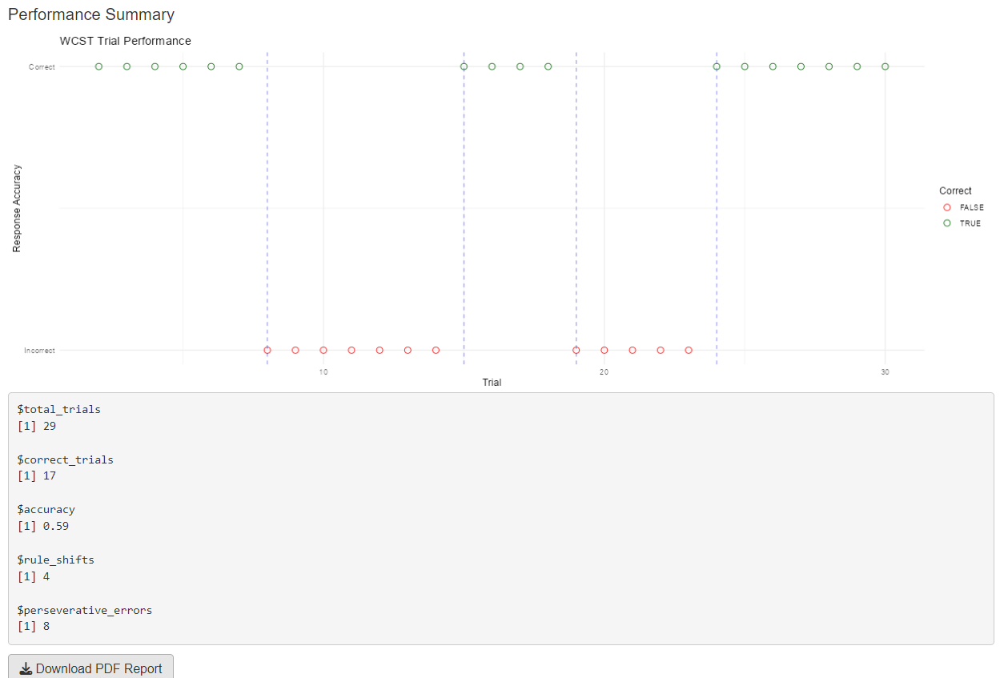

```{r, include=FALSE}
knitr::opts_chunk$set(
  collapse = TRUE,
  comment = "#>"
)
library(Max.WCST.R)
```

## What is Max.WCST.R?

Max.WCST.R provides tools to simulate and analyze the Wisconsin Card Sorting Task (WCST) — a classic neuropsychological task that measures cognitive flexibility and abstract reasoning.

This task is especially relevant for detecting executive dysfunctions in conditions such as:

- Schizophrenia  
- Frontal lobe damage  
- ADHD  
- Autism Spectrum Disorder (ASD)  
- Traumatic Brain Injury (TBI)  
- Neurodegenerative disorders (e.g., Parkinson’s, dementia)

In WCST, users must discover the sorting rule (color, shape, or number), adapt to rule changes, and avoid perseverative errors. This package implements a simulation framework for this logic.

## Key Features

- Generate realistic WCST decks with randomized rule shifts  
- Run interactive sessions using a Shiny interface  
- Automatically track accuracy, rule inference, and error types  
- Analyze trial-by-trial results  
- Export a PDF report of session performance  

## Generate a WCST Deck

```{r}
deck <- generate_wcst_deck(10)
head(deck)
```

  
*Figure 1: Example of a WCST deck showing color, shape, number, and rule.*

## Simulate a WCST Session

```{r}
session <- simulate_wcst_session(n_trials = 15)
head(session)
```

  
*Figure 2: Output from a simulated session.*

## Analyze the Results

```{r}
analyze_wcst_results(session)
```

  
*Figure 3: Trial-by-trial performance plot with rule switch markers.*

## Visualize the Results

```{r}
plot_wcst_performance(session)
```

## Full Example Workflow

```{r}
deck <- generate_wcst_deck(20)
session <- simulate_wcst_session(20)
analyze_wcst_results(session)
plot_wcst_performance(session)
```

## Run the Shiny App

```{r eval=FALSE}
run_wcst_app()
```

This opens a browser interface where users:

- Select the rule they believe is correct (color/shape/number)  
- Get real-time feedback  
- Are tested on rule adaptation  
- Receive a PDF report at the end with their results  

  
*Figure 4: Shiny interface for selecting a rule.*

  
*Figure 5: Example PDF summary report.*

## Extending Max.WCST.R

Possible extensions:

- Simulate different user profiles (e.g., random, perseverative, guessing)  
- Add longitudinal testing support  
- Connect to experimental data collection platforms  
- Customize scoring or rule-switching thresholds  

## Citation

To cite this package:

**Max.WCST.R**: Wisconsin Card Sorting Task Simulation and Analysis in R. Version 0.1.0.
